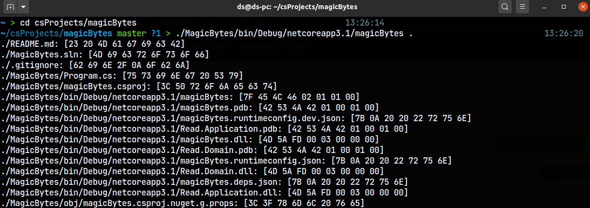

# MagicBytes

## About

This project is about to write simple and specific tool which would go through
some set of files and take their few first bytes.


## Compilation

Project is written in C# and compiled by .NET Core, so in order to compile it
you have to have .NET Core installed. To compile the project just run

```
dotnet build
```

in repo root catalog. The project doesn't use any external libraries, only C#
standard library.

**TODO** add some details about version.


## Usage

At this point only the basic version of the program is implemented.
To use the `MagicByte` program run the following after compilation

```
./MagicBytes/bin/Debug/netcoreapp3.1/magicBytes ~/path/to/catalog
```

For now result is printed on the standard out in form of `fullPath: [magic bytes]`:




## TODO

1. [x] Pass results on the fly (don't accumulate all results in a `List<T>`)
1. [] Implement concurrent version (Update 2020-10-08: so far concurrent versions (more than 1) are slower then synchronus version)
1. [] Setup a few flags (for recursive traverse, output format, concurrency and so on...)
1. [] Write built-in mini help
1. [x] Test on Windows
